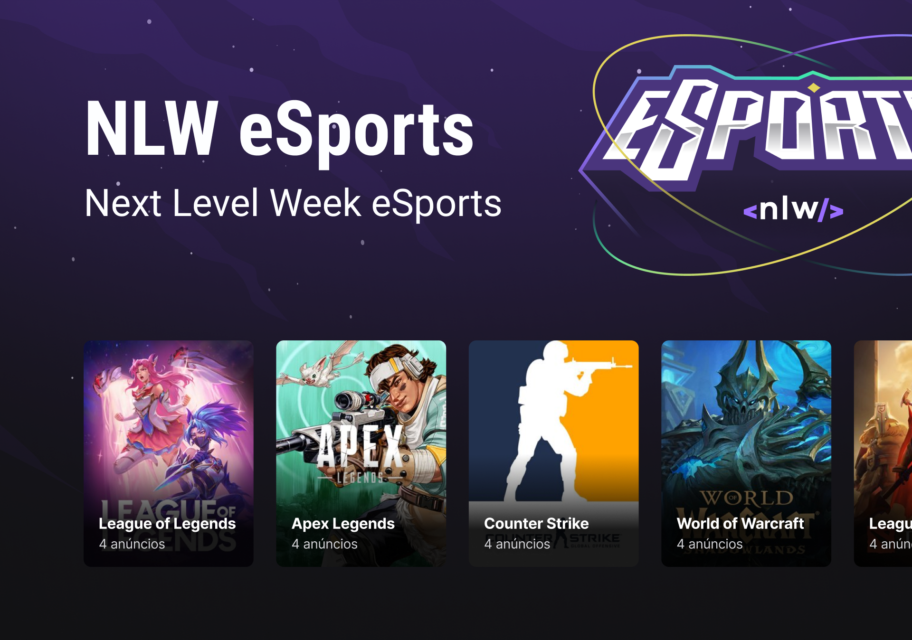

<p align="center">
      
</p>

<h1 align="center">NLW eSports</h1>

<div align="center">

[](LICENSE)
[](https://www.rocketseat.com.br/)
</div>

<h2 align="center">Topics 📋</h2>

   <p>
   
   - [About 📖](#about-)
   - [Functionalities 🛠️](#functionalities-%EF%B8%8F)
   - [Resources 📋](#resources-)
   - [Running the project locally  🔨](#running-the-project-locally--)
   - [How to Contribute 💪🏾](#how-to-contribute-)
   - [Contributors 🚀](#contributors-)

   </p>

---

<h2 align="center">About 📖</h2>

<p align="center">
    This project was developed at NLW, A.K.A Next Level Week, eSports an intense week of studies, networking, friendship, group work, accompanied by a sensational project developed by Rocketseat from the 12th to the 18th of June.<br>
    This application is a is an application where you can find people to play with you.<br> 
    In the <b>Web application, developed in ReactJs</b>, you can register ads in several games, that you have interest and availability to play with someone.<br>
    In the <b>Mobile application, developed in React Native</b>, you can see people's ads in several games and connect with them via Discord. <br>
    All this being managed by the <b>Backend server that we developed in <b>NodeJs</b>.<br>
</p>

   <p align="center">
      
   </p>

---

<h2 align="center">Functionalities 🛠️</h2>

   <p>

- Web App (ReactJS w/ Vite)
    - List available games;
    - Register your announcement of availability to play with someone;
- Mobile App (React Native w/ Expo)
    - List available games;
    - List availability announcements to play with someone;
- Backend (NodeJS w/ Express)
    - Make the endpoints available;
    - Save data to a SQL database via Prisma;
   </p>

---

<h2 align="center">Resources 📋</h2>

- [NLW eSports - Ignite](https://efficient-sloth-d85.notion.site/Ignite-18c1174738e54f1d8e742f794e210cd2) 📚

---

<h2 align="center">Running the project locally  🔨</h2>

<h3>Backend server 🛣</h3>

   ```
   First of all, correctly configure the NodeJS development environment on your machine, see https://efficient-sloth-d85.notion.site/Instalando-o-Node-js-25018081f5e1435e970b2a8b35cd15f6.
   
   - Clone this repository:
   $ git clone https://github.com/samuelematias/nlw-esports.git

   - Enter in directory:
   $ cd nlw-esports

   - Enter in server directory:
   $ cd server

   - For install server dependencies:
   $ npm install

   - Run the server: 
    $ npm run dev

   ```

   <h3>Web app 🖥</h3>

   ```
   First of all, its necessary stay with the Backend up, so follow the previous Tutorial about Starup the Backend server.

   Second of all, correctly configure the ReactJS development environment on your machine, see https://reactjs.org/docs/getting-started.html.

   - With the Backend server Up, Enter in the main directory:
   $ cd nlw-esports

   - Enter in web directory:
   $ cd web

   - For install server dependencies:
   $ npm install

   - Run the server: 
    $ npm run dev
   ```

  <h3>Mobile app 📱</h3>

   ```
   First of all, its necessary stay with the Backend up, so follow the previous Tutorial about Starup the Backend server.

   Second of all, correctly configure the React Native development environment on your machine, see https://reactnative.dev/docs/0.60/enviroment-setup, and the Expo development environment on your machine, see https://efficient-sloth-d85.notion.site/Instalando-Expo-9b0abcb12bd548278e042d00fbde67f2.

   Third of all, its necessary change the ip address in the constants file (mobile/src/utils/constants.ts), ADDRESS variable, to your ip address, check you ip address running ifconfig in your terminal, but don't replace the last numbers in the address, 3333, this is the server port.

   - With the Backend server Up, Enter in the main directory:
   $ cd nlw-esports

   - Enter in web directory:
   $ cd mobile

   - For install server dependencies:
   $ npm install

   - Run the server: 
    $ npm start
   ```

---

<h2 align="center">How to Contribute 💪🏾</h2>

   ```
   - Fork the project 

   - Create a new branch with your changes:
   $ git checkout -b my-feature

   - Save your changes and create a commit message telling you what you did:
   $ git commit -m "feature: My new feature"

   - Submit your changes:
   $ git push origin my-feature
   ```

---

<h2 align="center">Contributors 🚀</h2>

<!-- prettier-ignore -->
<table>
  <tr>
    <td align="center"><a href="https://twitter.com/samuelematias"><br /><sub><b>Samuel Matias</b></sub></a><br /><a href="https://www.linkedin.com/in/samuelematias/"title="Code">💻</a><a href="https://linktr.ee/samuelematias"title="Design"> 🎨</a></td></td>
</table>
